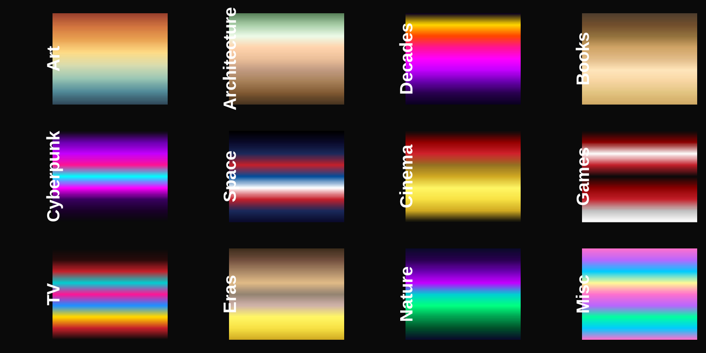
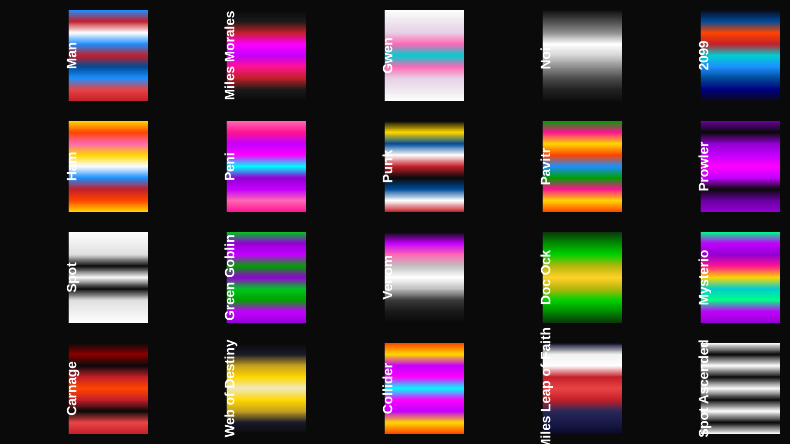
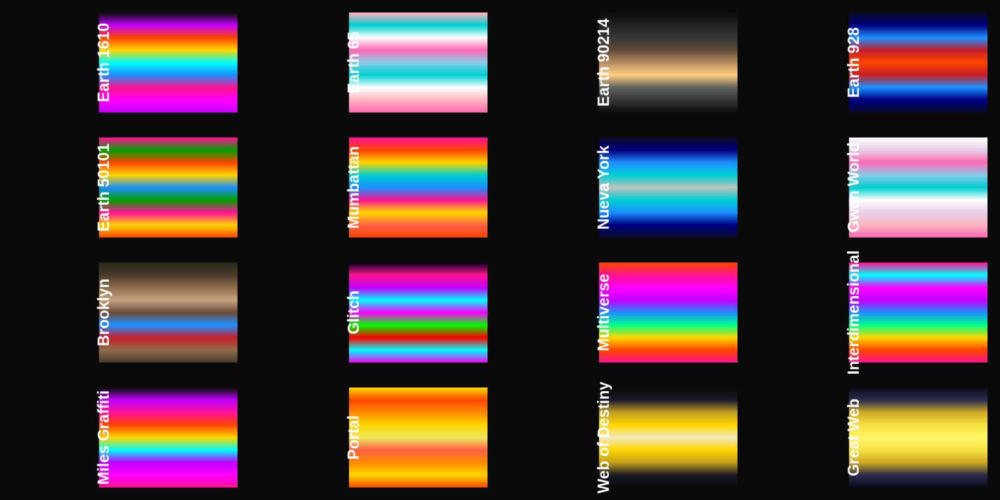
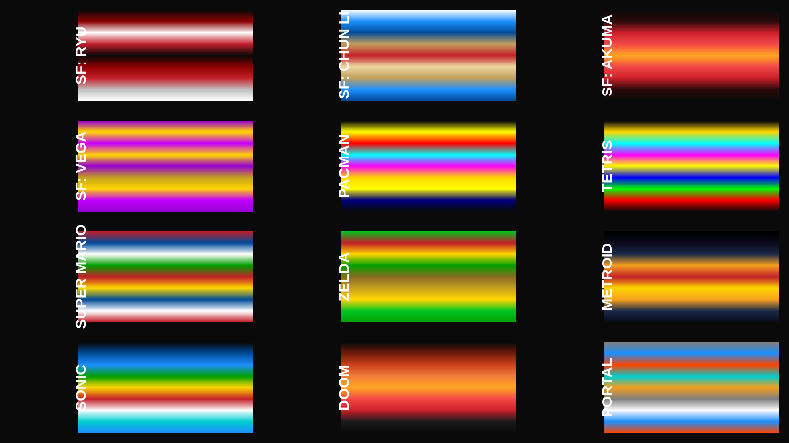
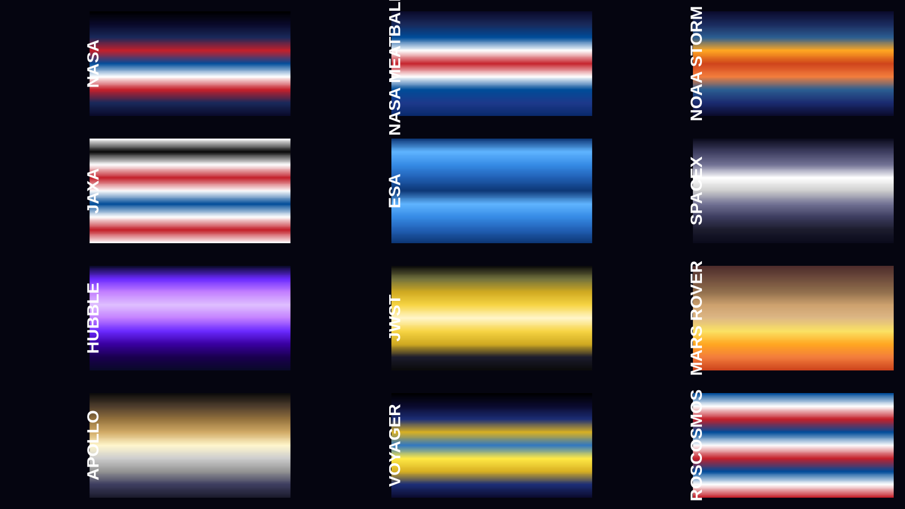
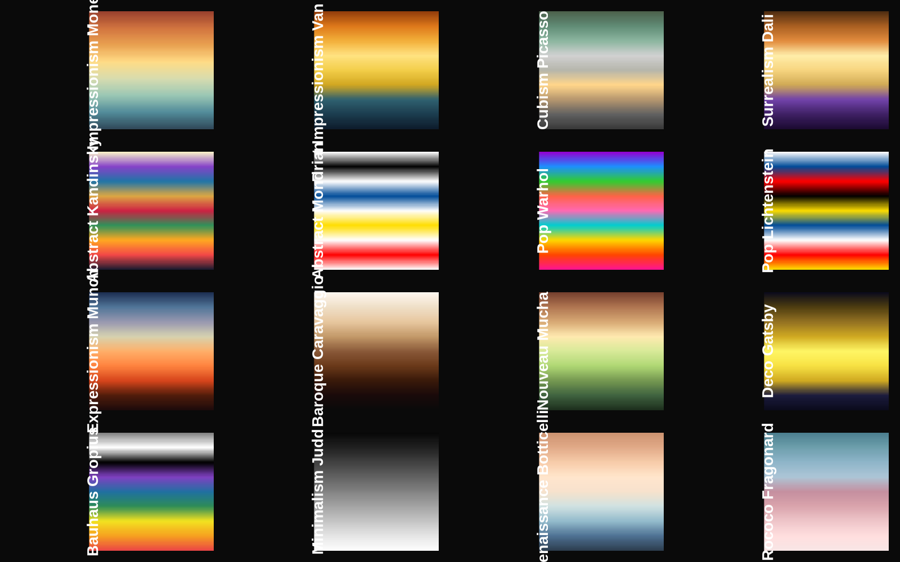
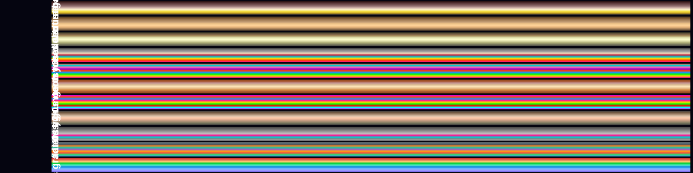

# pycptcity 

**7,716 colour palettes for Python — from scientific gradients to the Spider-Verse.**

[](https://github.com/ibarraespinosa/pycptcity/actions/workflows/tests.yml)
[](https://www.gnu.org/licenses/gpl-3.0)

---

> *"When do I know I'm Spider-Man?" — "You won't. It's a leap of faith. That's all it is, Miles. A leap of faith."*
>
> **pycptcity** brings the iconic visual energy of *Into the Spider-Verse* directly into Python! With **7,716 colour gradients** — including **63 dedicated Spider-Verse palettes** and **14 NOAA palettes** — you can render maps, spatial rasters, and plots in the exact colour spectrums of Miles Morales, Earth-1610, Gwen Stacy, and the Multiverse.

---

## What's inside

The classic gradients from the [cpt-city archive](https://phillips.shef.ac.uk/pub/cpt-city/) — plus **hundreds of curated palettes** across 26 categories: art, architecture, decades, books, cyberpunk, space agencies, **NOAA**, video games, cinema, music, anime, cities, mythology, science, Brazil, films, gemstones, weather, comics, food, albums, photography, and the entire **Spider-Verse.**

<p align="center">
  
</p>

---

## Four functions. That's it.

| Function | What it does |
|---|---|
| `cpt(pal, n, colorrampalette, rev, frgb)` | Returns a colour gradient — list of hex strings or a ramp function |
| `find_cpt(keyword)` | Searches 7716 palette names (case-insensitive) |
| `show_cpt(names)` | Displays palettes side-by-side as colour bars |
| `lucky()` | Random palette — "I'm Feeling Lucky" for colours |

```bash
pip install git+https://github.com/ibarraespinosa/pycptcity
```

```python
from pycptcity import cpt, find_cpt, lucky, show_cpt

# Miles Morales "What's Up Danger" Search
find_cpt("miles")         # ['spider_miles_morales', 'spider_miles_graffiti', 'spider_miles_leap_of_faith']

# Get Miles Morales colours
cols = cpt("spider_miles_leap_of_faith", n = 100)

# Preview Spider-Verse palettes
show_cpt(find_cpt("spider_miles"))
```

---

## NOAA palettes — 14 ramps for Earth science

NOAA stands for the National Oceanographic and Atmospheric Administration —
there is nothing space about it, so the ramps are named `noaa_*`. Built for
NOAA work: NWS forecasting, NHC hurricanes, NEXRAD radar, GOES satellites,
NDBC buoys, NCEI climate, NMFS fisheries, and more.

The `noaa` palette itself uses the colours of the NOAA emblem: deep navy sea,
NOAA blue sky, light and pale blues, and the white gull. A simplified,
non-official replication — here is the whole thing, code and figure:

```python
import numpy as np
import matplotlib.pyplot as plt
from matplotlib.colors import to_rgb
from matplotlib.patches import Circle, Ellipse, Wedge
from pycptcity import cpt

NAVY, BLUE, SKY, WHITE = "#0B2D72", "#1E6BB8", "#7FB2E5", "#FFFFFF"

fig, ax = plt.subplots(figsize=(4, 5))
ax.set_xlim(-1.1, 1.1); ax.set_ylim(-1.5, 1.1)
ax.set_aspect("equal"); ax.axis("off")

# sky / sea disc + white ring
ax.add_patch(Wedge((0, 0), 1, 0, 180, fc=SKY, ec="none"))
ax.add_patch(Wedge((0, 0), 1, 180, 360, fc=NAVY, ec="none"))
ax.add_patch(Circle((0, 0), 1, fc="none", ec=WHITE, lw=3))

# clouds
for xy, wh in [((-0.42, 0.52), (0.52, 0.20)), ((0.34, 0.62), (0.46, 0.18))]:
    ax.add_patch(Ellipse(xy, *wh, fc=WHITE, ec="none"))

# the gull: two white arcs
t = np.linspace(0, np.pi, 60)
for dx in (-0.30, 0.0):
    ax.plot(dx + 0.30 * np.cos(t), 0.22 + 0.14 * np.sin(t),
            color=WHITE, lw=5, solid_capstyle="round")

# sea waves, clipped to the disc
x = np.linspace(-0.97, 0.97, 300)
for base, c, lw in [(-0.36, BLUE, 4), (-0.14, WHITE, 3), (0.10, "#3D8FD4", 3)]:
    y = base + 0.03 * np.sin(4.2 * np.pi * x + 5 * base)
    keep = x ** 2 + y ** 2 <= 0.94
    ax.plot(x[keep], y[keep], color=c, lw=lw)

# the `noaa` ramp itself
ramp = np.array([[to_rgb(c) for c in cpt("noaa", n=256)]])
ax.imshow(ramp, extent=(-0.9, 0.9, -1.35, -1.2))
ax.set_xlim(-1.1, 1.1); ax.set_ylim(-1.5, 1.1)
plt.show()
```


And the same replication in R base graphics:

```r
library(cptcity)
NAVY <- "#0B2D72"; BLUE <- "#1E6BB8"; SKY <- "#7FB2E5"; WHITE <- "#FFFFFF"

plot.new()
plot.window(xlim = c(-1.1, 1.1), ylim = c(-1.5, 1.1), asp = 1)

th <- seq(0, pi, length.out = 300)
polygon(c(-1, cos(th), 1), c(0, sin(th), 0), col = SKY, border = NA)         # sky
polygon(c(-1, cos(th + pi), 1), c(0, sin(th + pi), 0),
        col = NAVY, border = NA)                                             # sea
polygon(cos(seq(0, 2 * pi, 720)), sin(seq(0, 2 * pi, 720)),
        border = WHITE, lwd = 3)                                             # ring

cloud <- function(x, y, w, h) {                                              # clouds
  a <- seq(0, 2 * pi, length.out = 100)
  polygon(x + w / 2 * cos(a), y + h / 2 * sin(a), col = WHITE, border = NA)
}
cloud(-0.42, 0.52, 0.52, 0.20)
cloud(0.34, 0.62, 0.46, 0.18)

t <- seq(0, pi, length.out = 60)                                             # the gull
lines(-0.30 + 0.30 * cos(t), 0.22 + 0.14 * sin(t), col = WHITE, lwd = 6)
lines( 0.00 + 0.30 * cos(t), 0.22 + 0.14 * sin(t), col = WHITE, lwd = 6)

x <- seq(-0.97, 0.97, length.out = 300)                                      # waves
waves <- data.frame(base = c(-0.36, -0.14, 0.10),
                    col = c(BLUE, WHITE, "#3D8FD4"),
                    lw = c(4, 3, 3))
for (i in seq_len(nrow(waves))) {
  y <- waves$base[i] + 0.03 * sin(4.2 * pi * x + 5 * waves$base[i])
  keep <- x ^ 2 + y ^ 2 <= 0.94
  lines(x[keep], y[keep], col = waves$col[i], lwd = waves$lw[i])
}

cols <- cpt("noaa", n = 256)                                                 # the ramp
n <- length(cols)
for (i in seq_len(n))
  rect(-0.9 + (i - 1) * 1.8 / n, -1.35, -0.9 + i * 1.8 / n, -1.2,
       col = cols[i], border = NA)
```


```python
from pycptcity import cpt, find_cpt

find_cpt("noaa")
# ['noaa', 'noaa_storm', 'noaa_nws', 'noaa_nhc',
#  'noaa_nexrad', 'noaa_goes', 'noaa_buoy', 'noaa_ncei',
#  'noaa_nmfs', 'noaa_jetstream', 'noaa_tornado',
#  'noaa_wind_chill', 'noaa_heat_index', 'noaa_coastal']

# NOAA emblem blues and whites (navy -> blue -> pale -> white gull)
cols = cpt("noaa", n = 256)
```

| Palette | What it is |
|---|---|
| `noaa` | NOAA emblem — deep navy sea, blue sky, pale blues, white gull |
| `noaa_storm` | NOAA storm — deep blue through warning orange |
| `noaa_nws` | **National Weather Service** — NOAA navy, sky blue, white |
| `noaa_nhc` | **National Hurricane Center** — Saffir-Simpson green→yellow→orange→red→magenta |
| `noaa_nexrad` | **NEXRAD radar** — dBZ reflectivity cyan→green→yellow→orange→red→magenta→white |
| `noaa_goes` | **GOES satellite** — deep space, ocean, atmosphere, cloud white |
| `noaa_buoy` | **NDBC buoy** — deep ocean to sea foam |
| `noaa_ncei` | **NCEI climate** — anomaly cool blue → white → warm red |
| `noaa_nmfs` | **NMFS fisheries** — deep sea, kelp green, surface gold |
| `noaa_jetstream` | **Jet stream** — polar blue → temperate → tropical red |
| `noaa_tornado` | **Tornado warning** — dark to warning yellow to red |
| `noaa_wind_chill` | **Wind chill** — white to ice to deep cold navy |
| `noaa_heat_index` | **Heat index** — mild yellow to extreme maroon |
| `noaa_coastal` | **NOS coastal** — sand, shallow teal, deep blue |

```python
from plotnine import ggplot, aes, geom_raster, scale_fill_gradientn
from pycptcity import cpt

# Hurricane categories on a map
(ggplot(df, aes("lon", "lat", fill = "wind_speed"))
 + geom_raster()
 + scale_fill_gradientn(colors = cpt("noaa_nhc", n = 256)))

# Radar reflectivity
(ggplot(radar, aes("x", "y", fill = "dbz"))
 + geom_raster()
 + scale_fill_gradientn(colors = cpt("noaa_nexrad", n = 256)))

# Climate anomaly
scale_fill_gradientn(colors = cpt("noaa_ncei", n = 256))
```

---

## Use with plotnine (Python ggplot2)

plotnine's `scale_fill_gradientn` / `scale_colour_gradientn` accept a list of colours — exactly what `cpt()` returns:

```python
from plotnine import ggplot, aes, geom_raster, scale_fill_gradientn
from pycptcity import cpt

(ggplot(faithfuld, aes("waiting", "eruptions", fill = "density"))
 + geom_raster()
 + scale_fill_gradientn(colors = cpt("mpl_inferno", n = 256)))
```

```python
from plotnine import scale_colour_gradientn

scale_colour_gradientn(colors = cpt("spider_miles_leap_of_faith", n = 256))
```

---

## Spider-Verse Spotlight — 63 Palettes. Every Dimension.



> *"What's up, danger?"*
>
> The genius of *Spider-Man: Into the Spider-Verse* lies in its revolutionary colour language. Every dimension, every leap, and every character carries a unique visual signature.

### Miles Morales & Earth-1610 Collection


| Palette | Description / Vibe |
|---|---|
| `spider_miles_morales` | **Miles Morales** — stealth black suit, neon spray crimson, electric venom strike |
| `spider_miles_leap_of_faith` | **Leap of Faith** — rising into upside-down city lights (slate, blazing red, sky blue) |
| `spider_miles_graffiti` | **Brooklyn Street Art** — spray-can magenta, electric cyan, subway tagger glow |
| `spider_earth_1610` | **Earth-1610** — Miles' home dimension, halftone dots, vibrant urban comic culture |
| `spider_brooklyn` | **Brooklyn Skyline** — brownstone brick, evening purple, street lamp gold |
| `spider_prowler` | **The Prowler (Uncle Aaron)** — sinister predator purple, green claw glare, menacing shadow |

```python
from pycptcity import cpt

# Miles Morales "Leap of Faith" gradient
cols = cpt("spider_miles_leap_of_faith", n = 100)

# Electric Venom Strike matrix preview
import matplotlib.pyplot as plt
plt.imshow([[i for i in range(100)]], cmap = None, aspect = "auto",
           extent = [0, 1, 0, 1])
# or simply use the hex list with any plotting library
```

---

**HEROES — 14 palettes**

| Palette | Character |
|---|---|
| `spider_miles_morales` | Miles Morales — stealth black suit & neon spray |
| `spider_man` | Peter Parker — classic red & blue |
| `spider_gwen` | Ghost-Spider — pastel watercolor & ballet teal |
| `spider_noir` | 1930s monochrome detective |
| `spider_2099` | Miguel O'Hara — cyberpunk Nueva York future |
| `spider_punk` | Hobie Brown — Union Jack anarchy |
| `spider_pavitr` | Spider-Man India — saffron & emerald |
| `spider_ham` | Spider-Ham — cartoon primaries |
| `spider_peni` | Peni Parker — mecha magenta |
| `spider_scarlet` | Ben Reilly — hoodie red & blue |
| `spider_superior` | Otto Octavius — darker, sharper |
| `spider_symbiote` | The black suit — sleek & alien |
| `spider_byte` | Margo Kess — digital avatar |
| `spider_1602` | Elizabethan Spider — medieval tones |

**FAMILY & ALLIES — 8 palettes**

| Palette | Character |
|---|---|
| `spider_prowler` | Aaron Davis — purple menace |
| `spider_prowler_earth42` | Earth-42 Prowler — red & violet |
| `spider_rio_morales` | Rio Morales — warm Puerto Rican |
| `spider_jefferson_davis` | Jefferson Davis — police blues |
| `spider_aunt_may` | Aunt May — gentle earth tones |
| `spider_jessica_drew` | Spider-Woman — yellow & green |
| `spider_peter_b_parker` | Washed-up Peter — robe & regret |
| `spider_mayday` | Mayday Parker — baby Spider |

**VILLAINS — 15 palettes**

| Palette | Character |
|---|---|
| `spider_spot` | The Spot — white void, black dots |
| `spider_spot_ascended` | The Spot (full power) — reality-breaking B&W |
| `spider_green_goblin` | Norman Osborn — purple & green |
| `spider_venom` | The symbiote — black with pink tongue |
| `spider_carnage` | Cletus Kasady — blood red chaos |
| `spider_doc_ock` | Doc Ock — metallic green tentacles |
| `spider_kingpin` | Wilson Fisk — imposing white & black |
| `spider_mysterio` | Quentin Beck — illusion purple & gold |
| `spider_sandman` | Flint Marko — desert earth |
| `spider_electro` | Max Dillon — electric blue |
| `spider_vulture` | Adrian Toomes — deep teal |
| `spider_lizard` | Curt Connors — reptilian green |
| `spider_rhino` | Aleksei Sytsevich — grey armor |
| `spider_scorpion` | Mac Gargan — acid green & gold |
| `spider_tombstone` | Lonnie Lincoln — chalk white |

**DIMENSIONS & WORLDS — 9 palettes**

| Palette | World |
|---|---|
| `spider_earth_1610` | Miles' dimension — neon street art |
| `spider_earth_65` | Gwen's world — ballet pastels |
| `spider_earth_90214` | Noir's world — sepia shadows |
| `spider_earth_928` | 2099's Nueva York — cyber blue |
| `spider_earth_50101` | Pavitr's Mumbattan — vibrant India |
| `spider_mumbattan` | The city itself — saffron heat |
| `spider_nueva_york` | The future skyline — electric blue |
| `spider_gwen_world` | Gwen's watercolor dimension |
| `spider_brooklyn` | Miles' brownstone neighborhood |

**COSMIC & EFFECTS — 11 palettes**

| Palette | What it is |
|---|---|
| `spider_web_of_destiny` | The great golden web — threads of fate |
| `spider_great_web` | The multiverse web — radiant gold |
| `spider_spider_society` | Miguel's HQ — orange & black |
| `spider_portal` | Interdimensional portal — blazing orange |
| `spider_collider` | Kingpin's collider — purple annihilation |
| `spider_go_home_machine` | The Go-Home-Machine — white-hot orange |
| `spider_glitch` | The glitch effect — RGB static |
| `spider_multiverse` | Multiverse burst — every color at once |
| `spider_interdimensional` | Between dimensions — full spectrum |
| `spider_miles_graffiti` | Miles' spray can — street art neon |
| `spider_miles_leap_of_faith` | "What's up danger" — rising into light |

---



**Every world has its own colour language.** That's the genius of the Spider-Verse films — and why these palettes exist. Earth-65 breathes in pinks and teals. Earth-90214 lives in monochrome. Earth-928 runs on cyber-blue. The Web of Destiny glows gold against infinite black.

---

## The v2 palettes

### Games



Street Fighter, Pac-Man, Tetris, Mario, Zelda, Metroid, Sonic, Doom, Portal — arcade history in colour.

### Space agencies



NASA, NOAA, JAXA, ESA, SpaceX, Roscosmos. Plus Hubble, JWST, Mars Rover, Apollo, Voyager.

### Art movements



16 movements: Impressionism (Monet), Van Gogh, Cubism (Picasso), Surrealism (Dalí), Kandinsky, Mondrian, Pop Art (Warhol), Expressionism (Munch), Baroque, Art Nouveau, Art Deco, Bauhaus, Minimalism, Renaissance, Rococo.

### Decades timeline



From 1920s Gatsby to 2020s gradient design. Each era's aesthetic distilled into a colour ramp.

### More categories

| Prefix | Palettes | Example |
|---|---|---|
| `noaa_` | 14 | `noaa_nws`, `noaa_nhc`, `noaa_nexrad`, `noaa_goes` |
| `book_` | 14 | `book_dune_arrakis`, `book_neuromancer`, `book_1984_orwell` |
| `cyber_` | 7 | `cyber_2077_night_city`, `cyber_blade_runner`, `cyber_matrix` |
| `cinema_` | 8 | `cinema_mgm_lion`, `cinema_technicolor`, `cinema_film_noir` |
| `arch_` | 12 | `arch_fallingwater_wright`, `arch_sagrada_familia_gaudi` |
| `tv_` | 8 | `tv_stranger_things`, `tv_twin_peaks`, `tv_x_files` |
| `era_` | 9 | `era_ancient_egypt`, `era_wild_west`, `era_industrial` |
| `nature_` | 14 | `nature_aurora_borealis`, `nature_coral_reef`, `nature_nebula` |
| `misc_` | 8 | `misc_vaporwave`, `misc_outrun`, `misc_steampunk` |

---

## Installation

```bash
pip install git+https://github.com/ibarraespinosa/pycptcity
```

To update to the latest version:

```bash
pip install --upgrade git+https://github.com/ibarraespinosa/pycptcity
```

```python
from pycptcity import cpt

# Miles Morales Leap of Faith gradient
cols = cpt("spider_miles_leap_of_faith")

# Classic cpt-city palette
cols = cpt("mpl_inferno")
```

---

## Dependencies

None (stdlib only). `show_cpt` needs matplotlib — install with `pip install "git+https://github.com/ibarraespinosa/pycptcity[plot]"`.

---

## Platform support

Live status: [](https://github.com/ibarraespinosa/pycptcity/actions/workflows/tests.yml)

Every push runs the full test suite on **3 operating systems × 3 Python versions**
plus an install-from-GitHub-URL smoke test on each OS.

| OS | Python 3.9 | Python 3.11 | Python 3.12 |
|---|:---:|:---:|:---:|
| **Linux** (ubuntu-latest) | ✅ | ✅ | ✅ |
| **macOS** (macos-latest) | ✅ | ✅ | ✅ |
| **Windows** (windows-latest) | ✅ | ✅ | ✅ |

| OS | `pip install git+…/pycptcity` |
|---|:---:|
| **Linux** | ✅ |
| **macOS** | ✅ |
| **Windows** | ✅ |

Each job runs **31 tests** that verify byte-identical colour output against R's
`grDevices::colorRampPalette`, plus a plotnine integration smoke test
(`scale_fill_gradientn(colors = cpt(...))`).  The badge above shows live
pass/fail for the latest commit — click through for per-job logs and the
step summary.

---

## Citation

```python
# Sergio Ibarra-Espinosa (2026). pycptcity: cpt-city colour gradients for Python.
# https://github.com/ibarraespinosa/pycptcity
```

---

## License

GPL-3 — Palettes retain their original licenses (documented in the [cpt-city archive](https://phillips.shef.ac.uk/pub/cpt-city/)).

---

<p align="center">
  <sub>Made with <code>cpt("noaa_nhc")</code> — <a href="https://phillips.shef.ac.uk/pub/cpt-city/">cpt-city archive</a> — 7,716 gradients and counting — <i>What's Up Danger?</i></sub>
</p>
